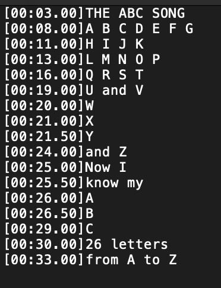
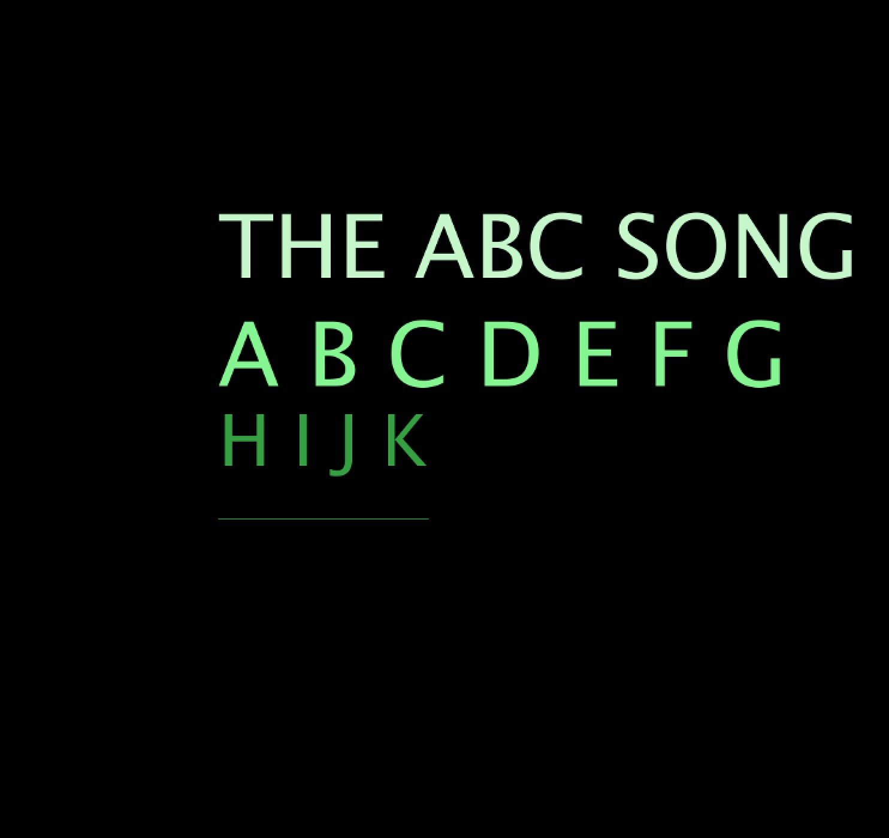
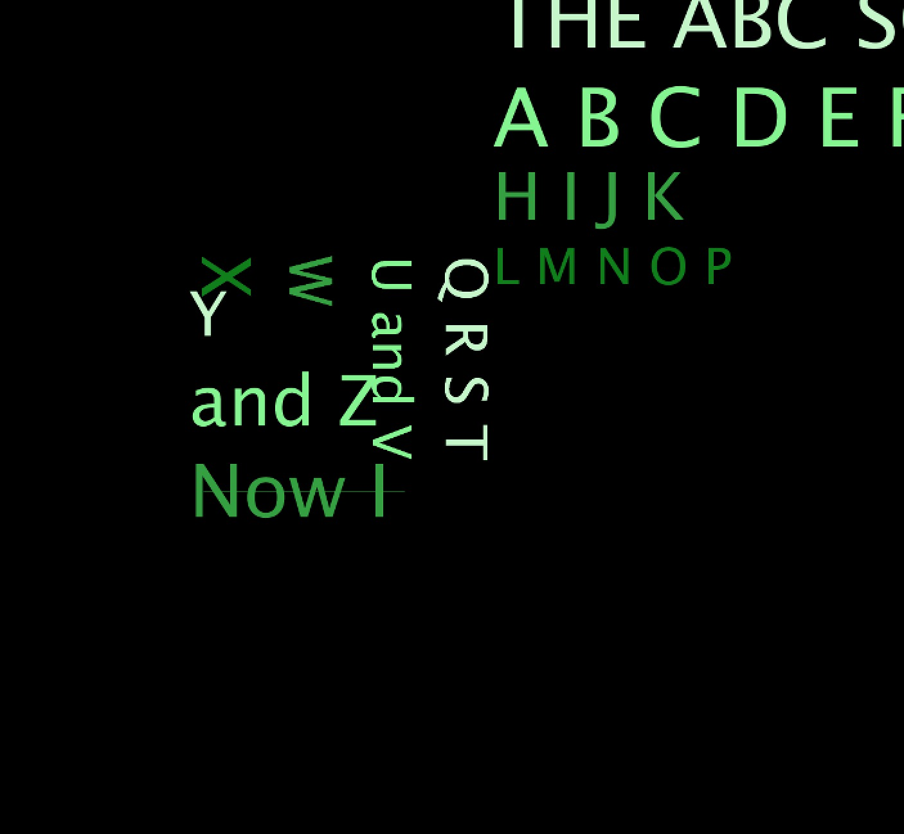
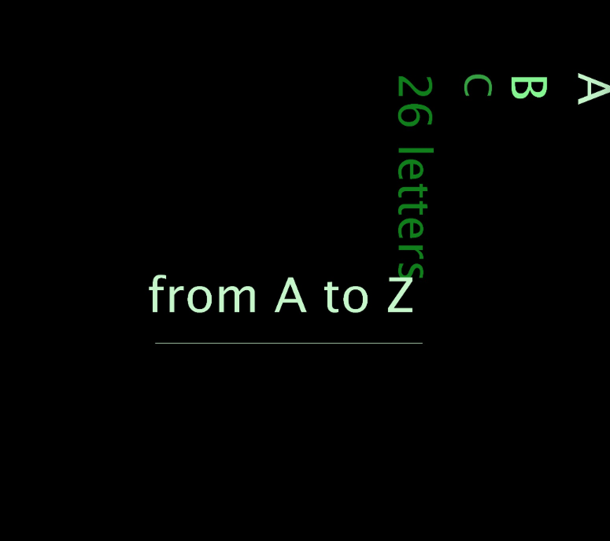

**Generative Lyrics**
===================

Video
----------
[Here](https://youtu.be/UM9xBvhYWTY) is the video :)

Description 
----------
This week's assignment was to do a data visualization or text generation, which reminded me of the AdobeAE project I did in high school: generative rotating captions. So I decided to reproduce the project using Processing. The idea was to do a generative lyrics subtitle for the “ABC Song”, along with the rotation and scaling special effects.

With that in mind, I started by creating a .txt file to include the lyrics and the exact duration time of each line, I split the imported text into two parts: display time and display content:

In the void setup( ), I call two functions to display the parameter initialization and to get the text from the file. In void draw( ), I call the main function “Run( )” to start displaying. I have two nested functions within Run( ). One is to update the text constantly. When it detects new text needs to be displayed, it randomly generates colors, rotating and scaling effects. Another is to display text to the screen.

The song is played from the web, and I experimented many times to let the lyrics come up just at the right time.

Images
----------

Problems
----------

The problem I encountered was that as the text rotated, it sometimes went beyond the edge of the screen. I searched online and found PGraphics which can draw into an off-screen buffer. It allows me to set up the outside area.
