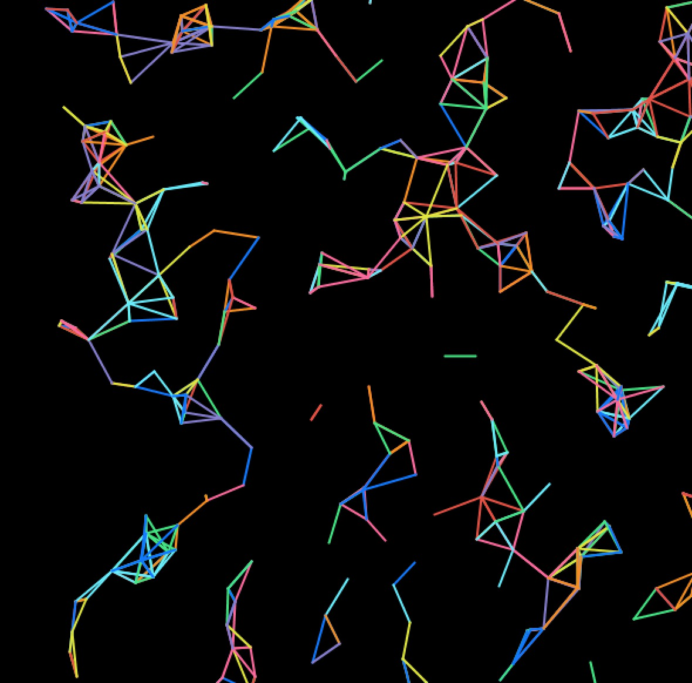
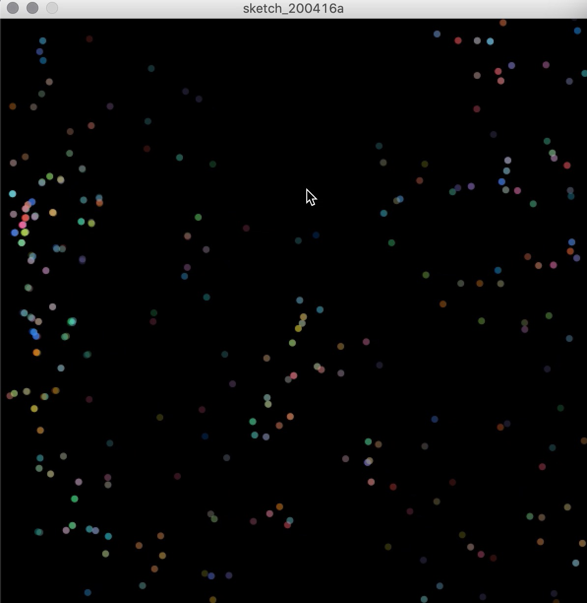

**Experiment**
===================

Video
----------
[Here](https://youtu.be/UM9xBvhYWTY) is the video :)

Description 
----------
This week's assignment was to experiment with Professor Aaron Sherwood's example we learned during the last class. I first tried to modify a couple of values to see their resulting change and to understand the code completely. To make the artwork more aesthetically interesting (at least for me), I messed around with the example by adjusting basic settings such as color, number of rotators, length of lines, and radius of rotation. I really enjoyed this process. As a way to create an artwork, It was not like painting, which could not be re-modified repeatedly. With a computer program, I can constantly experiment and improve according to my standards without consuming much time.

When I showed my experimented product to my friend, I found that he could not immediately understand the movement pattern of these rotators because the lines made the overall movement look complicated. So I wanted to add an interaction that when I press the mouse, the lines would disappear, and thus the track of the rotators can be observed very clearly. I used ellipse () to draw the rotators and fill () them with randomly generated colors. Once I released the mouse, it would return to the original one.

Images
----------

