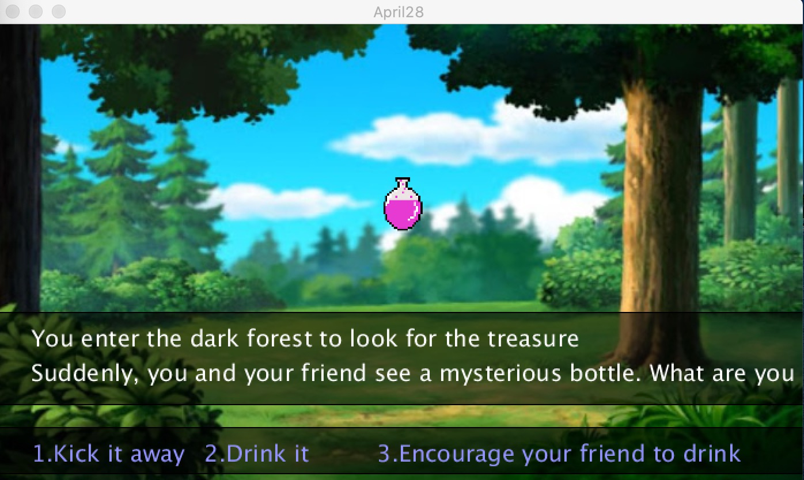
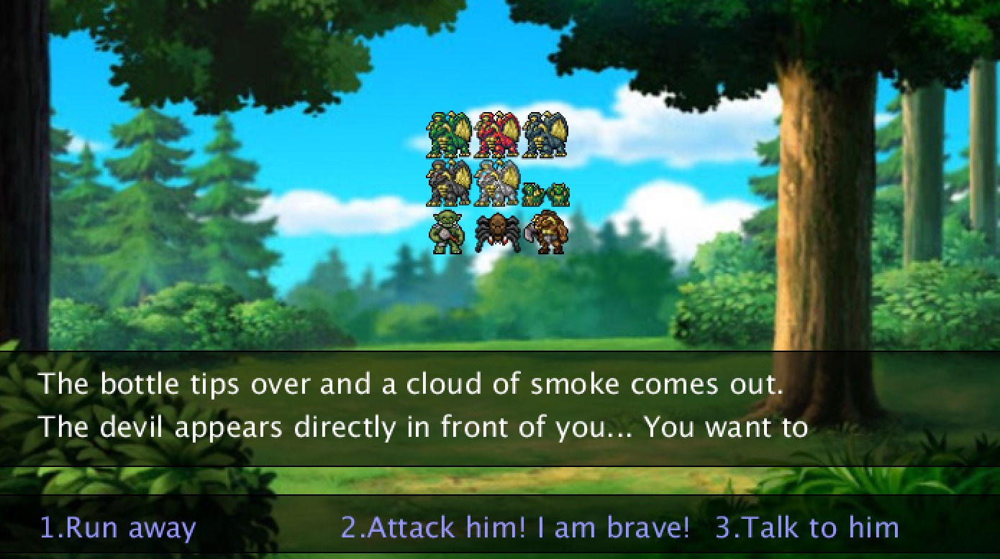
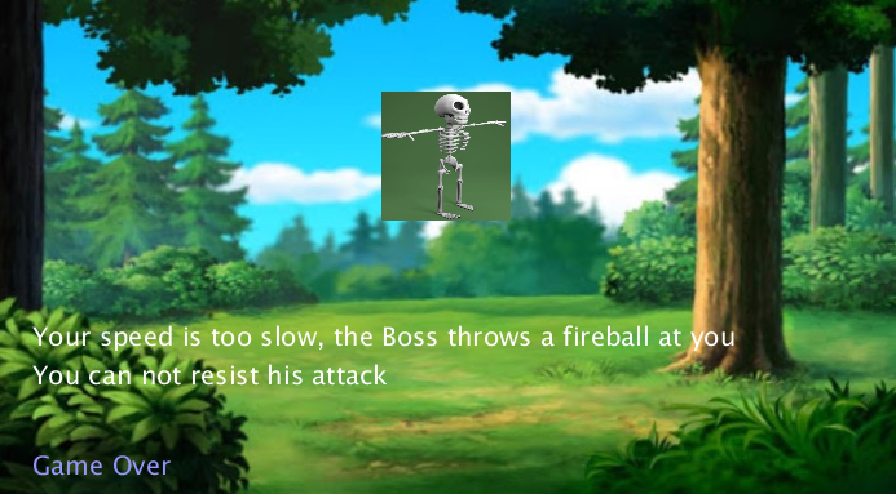

**Forest Adventure and Steve Jobs**
===================

Video
----------
[Here](https://youtu.be/Uem5a7U2HAw) is the video of Forest Adventure Game

[Here](https://youtu.be/NMN_67QwGeI) is the video of Steve Jobs

Description_1
----------
This week's assignment was to do something creative with images in Processing. I did two programs. The first was a forest adventure game for kids, which basically displayed different scenes according to the player's choice, and overlaid the pictures of the props upon the background. In the code, I designed six scenarios, and the player presses different numbers on the keyboard to trigger the next development.

Images_1
----------

Description_2
----------
The second is a filter that uses pixels to create a Mosaic effect. When I pressed the mouse, Steve's picture would become blurry and dotted.

Images
----------

