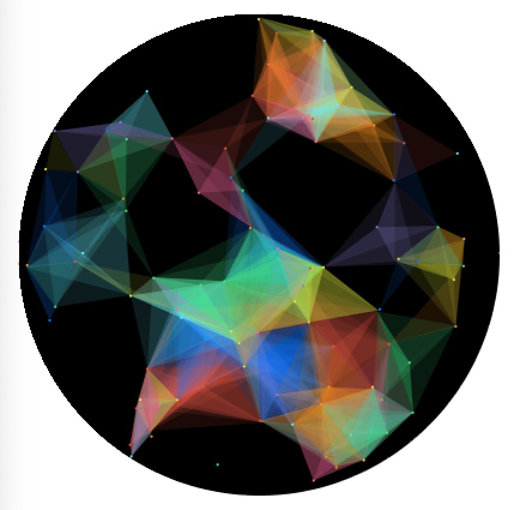
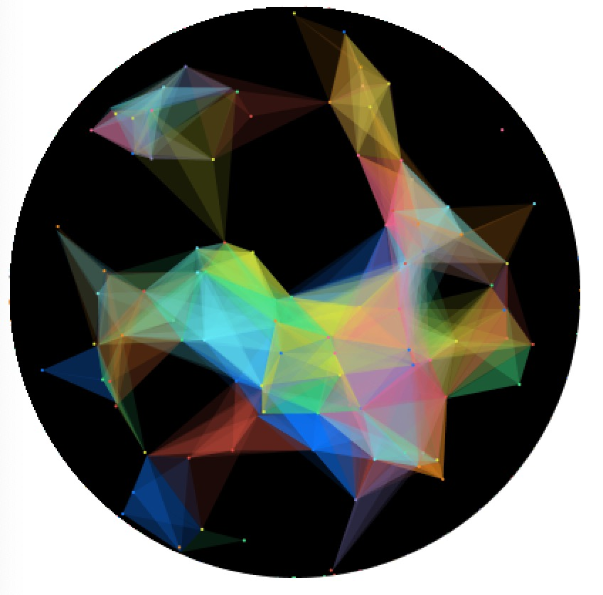
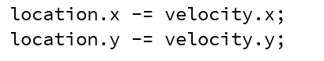

**Dynamic Kaleidoscope**
===================

Video
----------
[Here](https://youtu.be/Krtzkyz22f4) is the video :)

Description 
----------

This assignment was to design an artwork or a game, and I decided to model a dynamic kaleidoscope using Object-Oriented Programming. I first searched the composition mechanism of a kaleidoscope image. Basically, it has many moving dots randomly, and once the distances among three dots are smaller than a certain number, it will form a colored triangle. As the dots constantly move, the overall structure also changes. 

With that in mind, I start by creating a Class named Dots. It specifies the randomly filled colors and the velocity, and it includes the functionality of displaying dots and updating the locations of dots that always bounce within the circle. In void setup(), I initialize the starting point of the dots and store each new dot into an ArrayList for later use. In void draw(), I call methods on the dots from Class in a For loop, and then I check if the distance among three dots is smaller than the maximum value. If it is, I fill the triangle with the color specified before.

Images
----------

Problems

The biggest problem I had encountered was how to make the dots bounce back when they reached the edge of the circle. I first tried that the vector of location =location-velocity as shown below

However, it did not work. Then I thought of multiplying the velocity by -1 and then adding it to the location, which solved the problem successfully.
