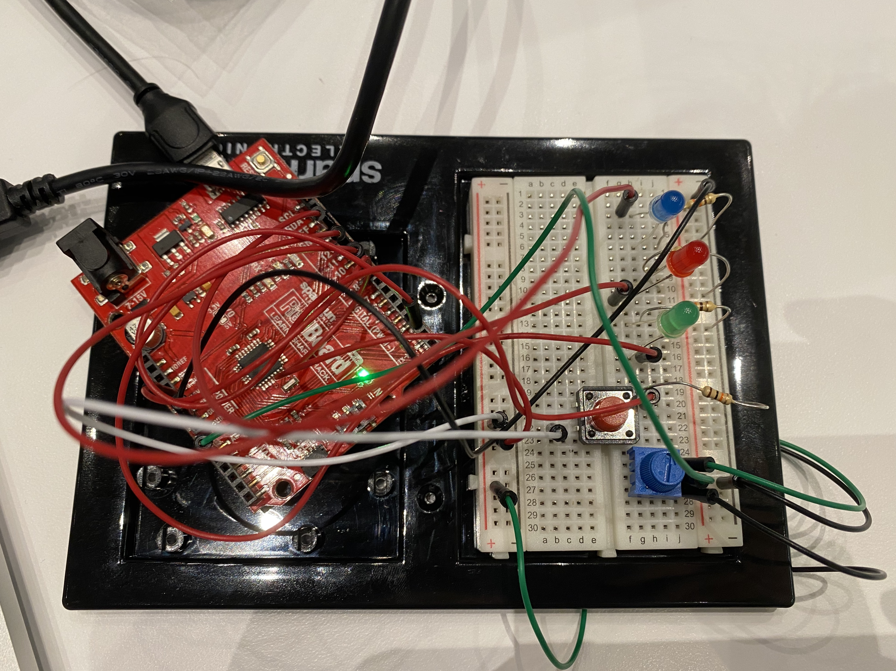

**Description of My Project**

For this second assignment, I decided to design a switch having four modes: three LEDs on, all off, blink, and alternative blink. The switch was controlled by a temporary button, but I programmed it to become a toggle button. To make the design be with multiple inputs, I utilized a potentiometer as another input to adjust the brightness of the LEDs when they are all on. 

With that idea in mind, I started by making a schematic:

The image of my Arduino:

The default mode is all off, as I press the button, the three LEDs would come on and not be off even if I release the button. The code here is different from what we have done in class. I included a nested loop to do this. As I twisted the potentiometer clockwise, the three LEDs gradually dimmed. The following two modes can also be switched to by pressing the button. I tried the “switch” function to make the LEDs blink alternatively.

