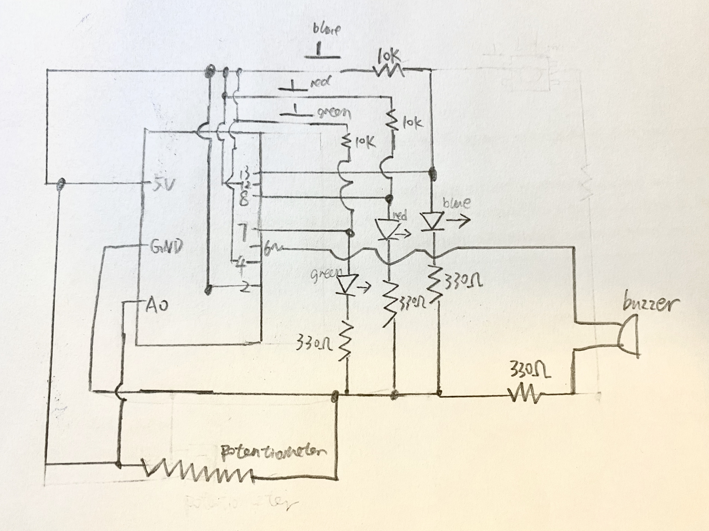

**Description of Assignment 3##

For this assignment, I wanted to try doing something with the buzzer and potentiometer. The digital inputs and outputs are three LEDs and their corresponding push-buttons; the analog inputs and outputs are the potentiometer and buzzer. Basically what I ended up with was that an LED came up when the corresponding button was pressed, with the buzzer sounded different tones. The volume could be adjusted by the potentiometer. 

With that idea in mind, I started by making a schematic:

Based on it, I build my Arduino:

So far so good.

However, troubles always occurred in the coding part. After I wrote the program according to my logic and ran it successfully, I found that the push-buttons didn't work. Even if I didn't press the button, the light would go on and the buzzer would sound. I kept modifying the details of my program, but the problem was not solved. I searched online, and one of the suggestions was to replace the INPUT in the setup with INPUT_PULLUP. Magically, the problem was solved. Although I read some explanations, I still had no idea what the difference was between the two INPUTS and why they would produce totally different results.

With that fixed, my whole program worked, but another problem was that when I twisted
the potentiometer to turn the volume up, the melody disappeared, and the buzzer only produced a single sound.

