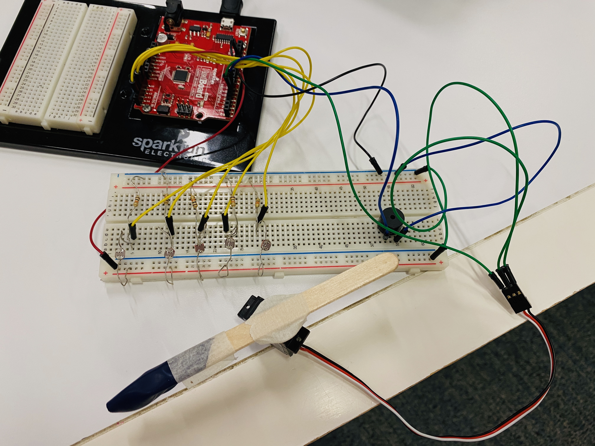

**Automatic Player**

For this project, we were tasked to create our own musical instrument using tone and servo. The concept of my design is to automatically play a predefined tune (Twinkle, twinkle, little star) when the five light sensors are shaded alternatively by the wooden stick controlled by the servo. The servo sweep is divided into five sections. After each move is done (when the wooden stick is right above the sensor), the Arduino would read a value from that sensor. Once the value is below a certain number, the buzzer will produce short tunes successively. Each of the light sensors corresponds to 3-4 notes, thus forming a complete tune.

In the circuit, I have five analog inputs (light sensors) and two outputs (buzzer and servo). The sweep is achieved by the “for” loop as the example we did in class. I have five “if” conditions that once the analogRead values are below 800, the sound would be produced according to the tone function.

The schematic of my entire circuit is attached below:

The images of my overall project and electronics:

And [Here](https://youtu.be/ug6bu-HrDrI) is my video :)
