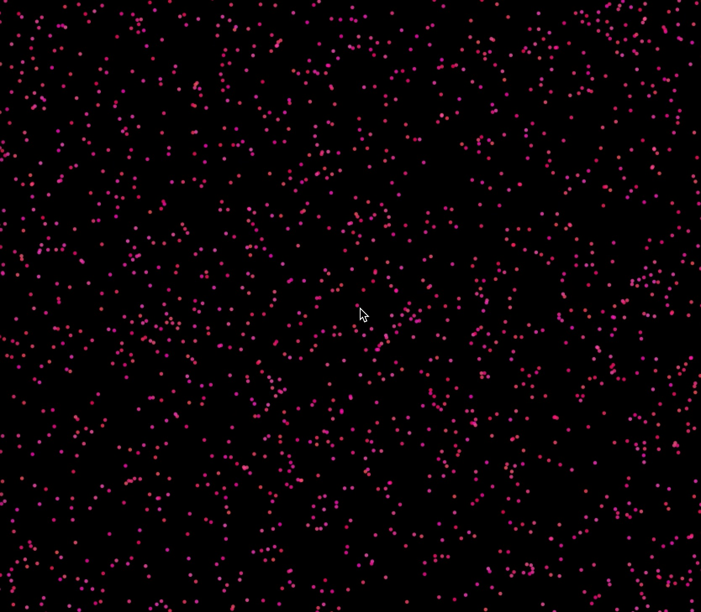
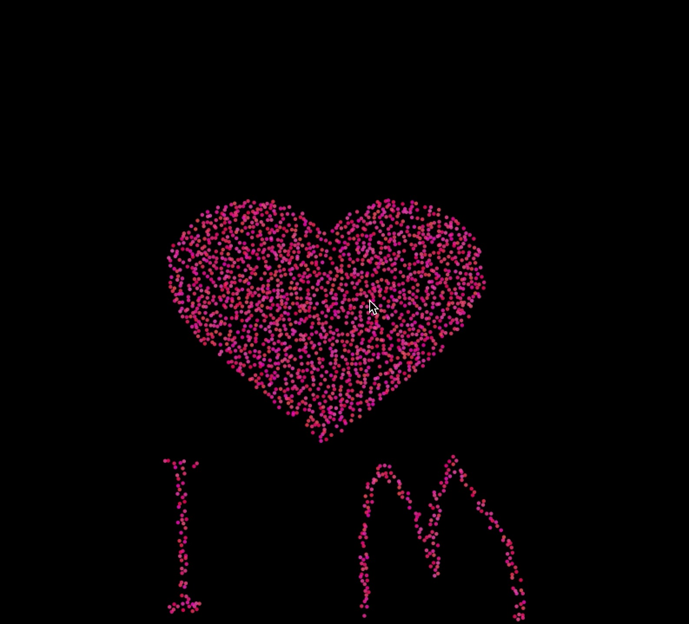
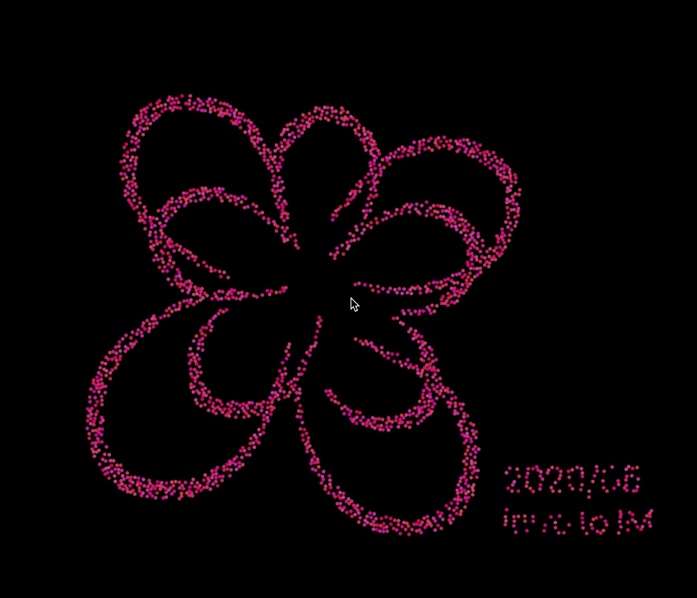
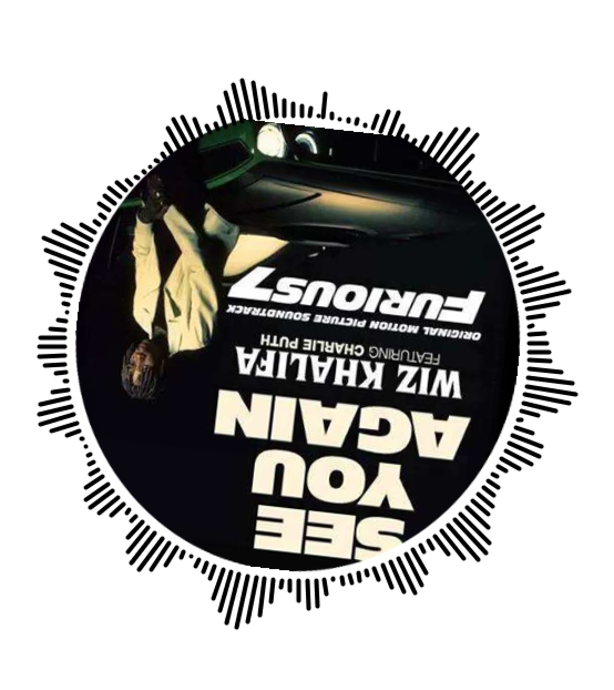
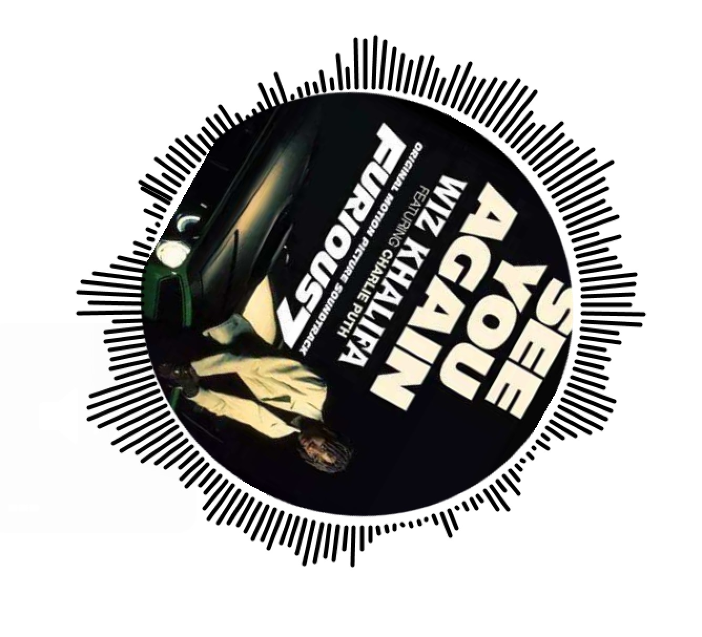

**Balls with love & See you again**
===================

The final assignment for this semester is to do a comprehensive project integrating all the skills we have learned about processing. Inspired by a Java advert's GIF, which had a collection of randomly moving balls that form four letters:"JAVA", I decided to do reproduce a similar dynamic effect but with more interaction. After I was almost done with this project, I found that it did not involve the sound part, so I did a second project focusing on playing and visualizing sound. When I play a song using an app on my phone, the album cover of that song would rotate along with the music on the interface, like a traditional CD player. So I wanted to do something similar with Processing.

Video
----------
[Here](https://youtu.be/4GvdfF2RK6Y) is the video of "Balls with love"

[Here](https://youtu.be/ngm7KDZJ480) is the video of "See you again"

First Project Concept
----------
I first found three black and white pictures. Because the purpose was to make the balls aggregate into the shape of the pictures in the data folder, I chose pictures with monotonous colors to facilitate the location recognition. I first did the calculation of oriPos[] position in setup(). The idea was to find a random location in the image, and to determine whether the pixels on that location were white. If corresponding pixel color was white, it would be stored as current ball target location. If the color was not white, it would continue looking for the next random location and determining the color until the condition is met.

Free-moving ball > approaching motion > white area of the image

Steps:
1. Create a variable for the ball Class to store its position on the image, that is, the target position;
2. In the setup initialization, calculate the target position of each ball on the image;
3. Make the balls do not overlap with each other at the target positions on the image, and try to cover the white area completely;
4. When the aggregation state is switched, the balls move from the current position to the target position.

Images
----------

Problems
----------
The biggest problem I had was border control, which I ignored at first, so the ball wouldn't bounce back when it hit the border, but would continue to run out of the frame. My solution to the problem was to add a move() function, and I used four if conditions to make the ball bounce when it met the border, so that it won't run out of the frame again. In the class, all the movement paths of the ball are simply "start → float → hit the border → bounce → continue to float".

Second Project Concept
----------
I chose to play a farewell song in the second project.  Due to the Coronavirus, we may not be able to be with our friends or family or loved ones, so I hope this song can bring some comfort.

First, I imported a round album image in the center of the canvas. The rotation was achieved by rotating the coordinate axis, and setting a theta variable to increase it a little bit in a loop.

Music visualization---dynamic scale:
I imported the Minim audio library before drawing the animation effects. By creating Minim objects, I loaded audio files and created sound inputs and outputs. A loop was also used to draw a line around a circular disc according to the music. Every time I drew a line, it would rotate by an angle. After rotating, the coordinate axis should be reset to the position without rotation every time, so pushMatrix() and popMatrix () should be applied.

Problems
----------
The biggest problem I encountered was that the lines of the dynamic scale would sometimes be drawn inward the picture, which would affect the visual effect. My solution was to add the absolute value of player.left.get(I) to make sure it was greater than 0.

Images
----------

