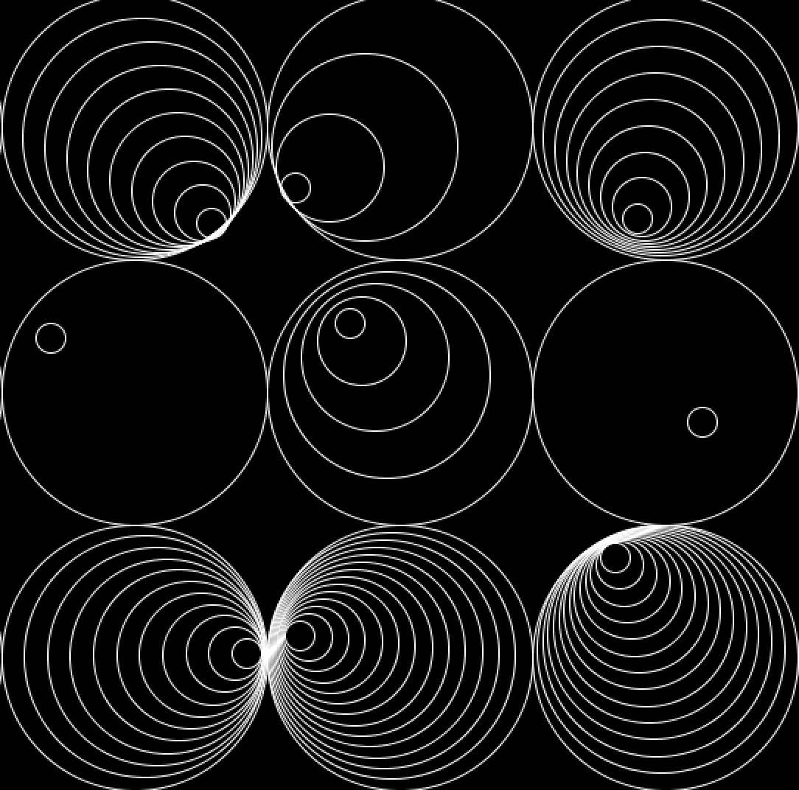
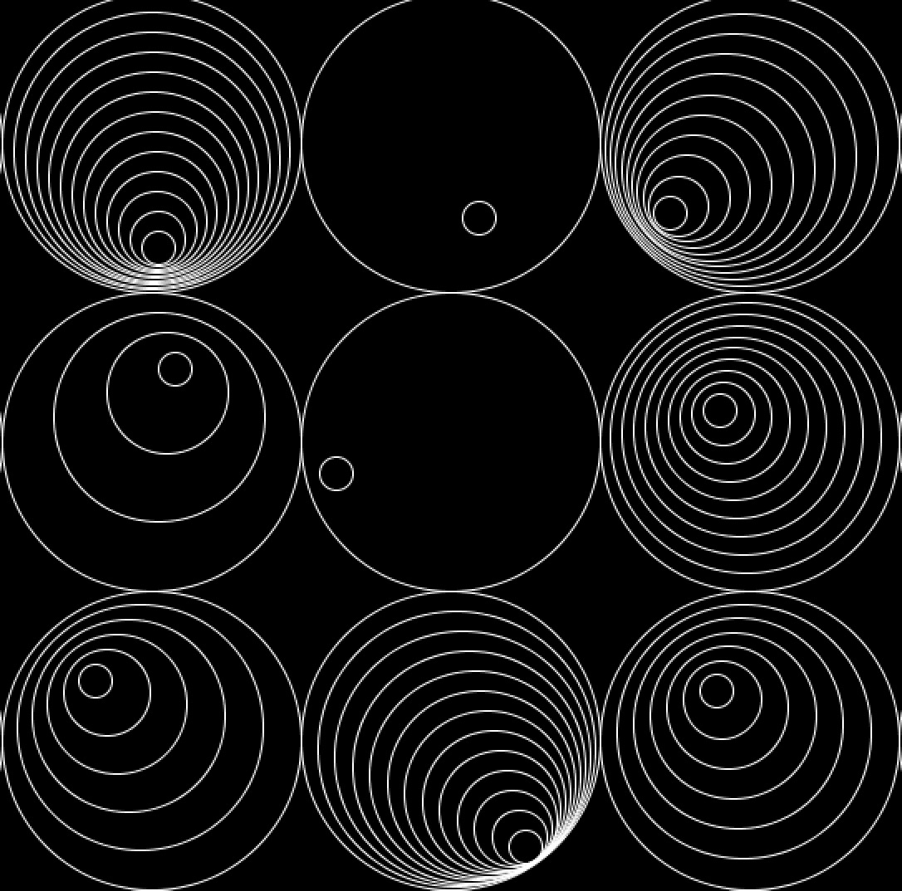
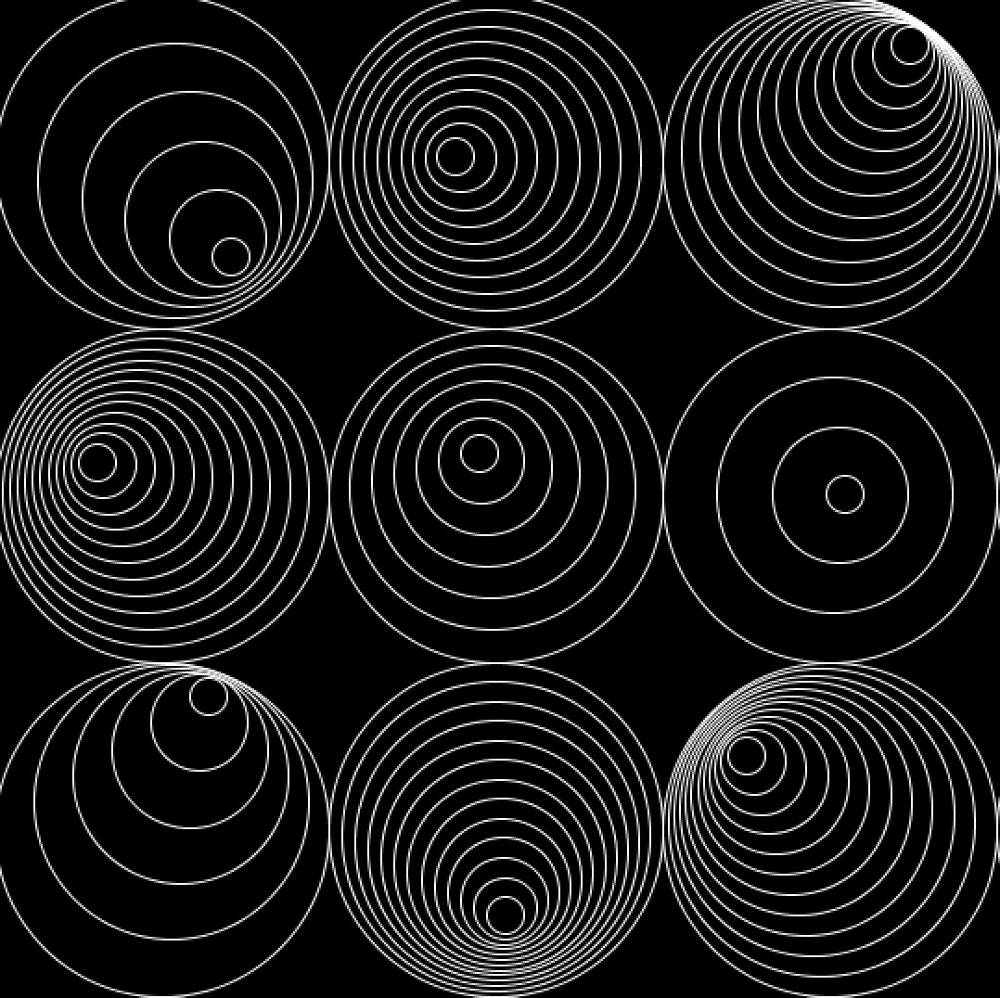

**Recreation of Computer Graphics and Art**
===================
 
For this project, I tried to recreate an old computer graphics art. The example I chose had random circles in each square. Instead of the square stack, I used ellipses to make the graphic more uniform. I randomized the radius and the location that the circle would appear within the biggest one. With putting this inside a for loop, I didn‘t had the write the code ten times all over again. I also used pushMatrix() and popMatrix() to do transformation.

Video
----------
[Here](https://youtu.be/sT5tdjMxwzA)  is the video :)

Images
----------

Problems
----------
The problem I encountered was that the center of the inner circles would sometimes be on the outside of the larger circle. I tried to adjust the variables of the center point, but I still couldn't solve the problem.

