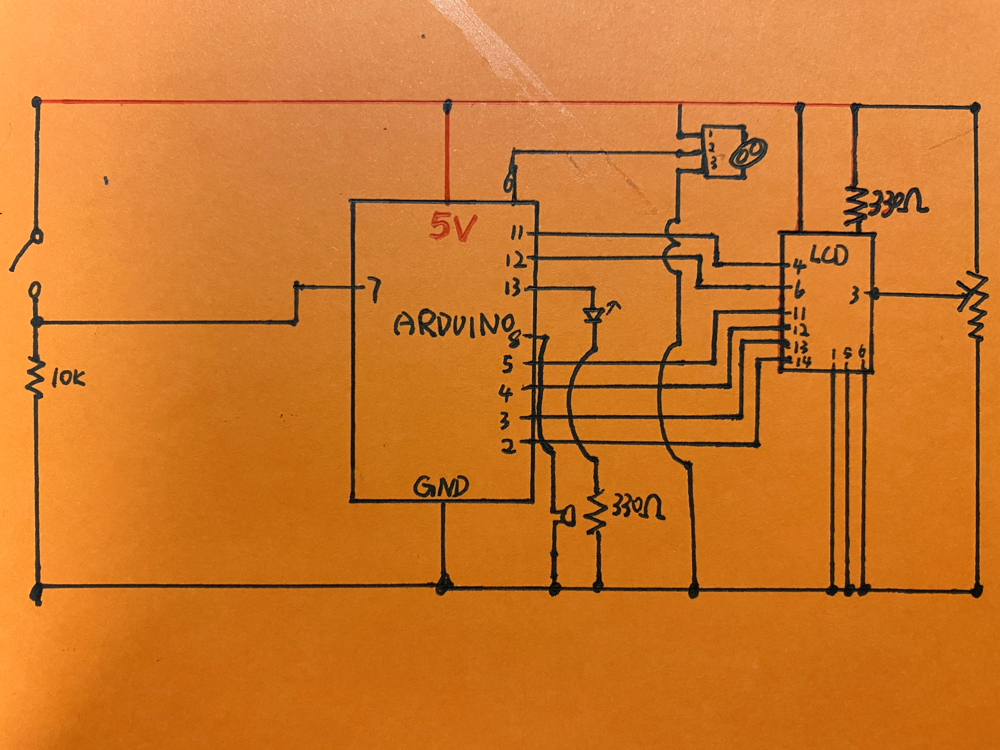
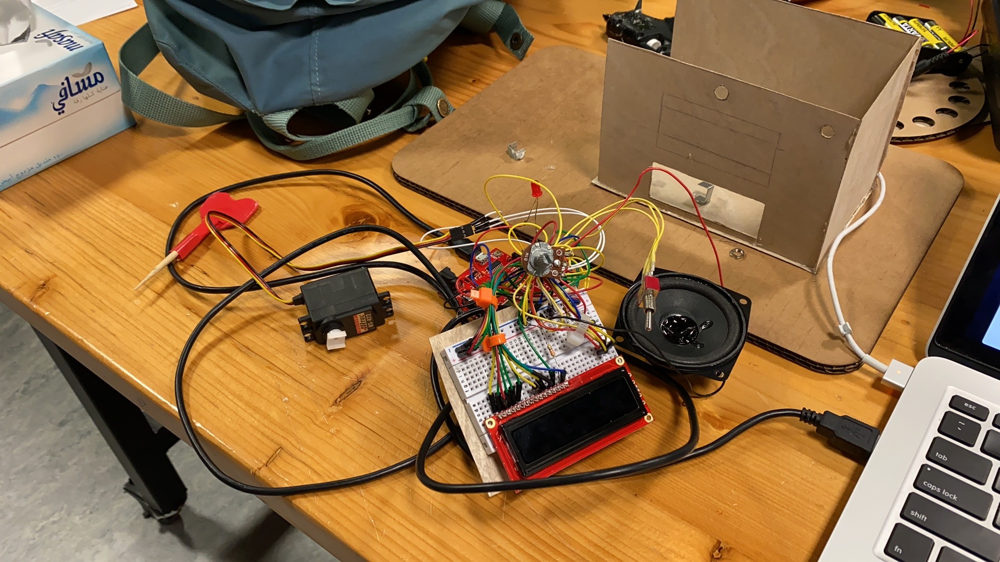
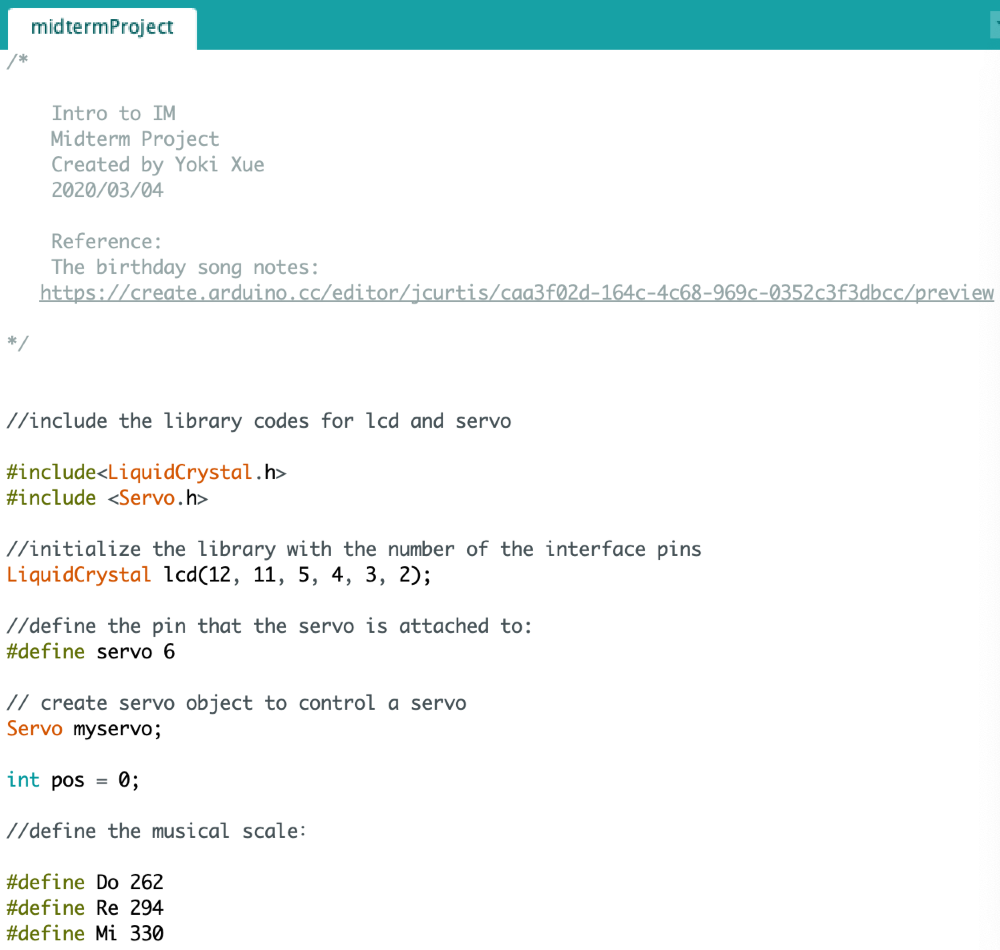
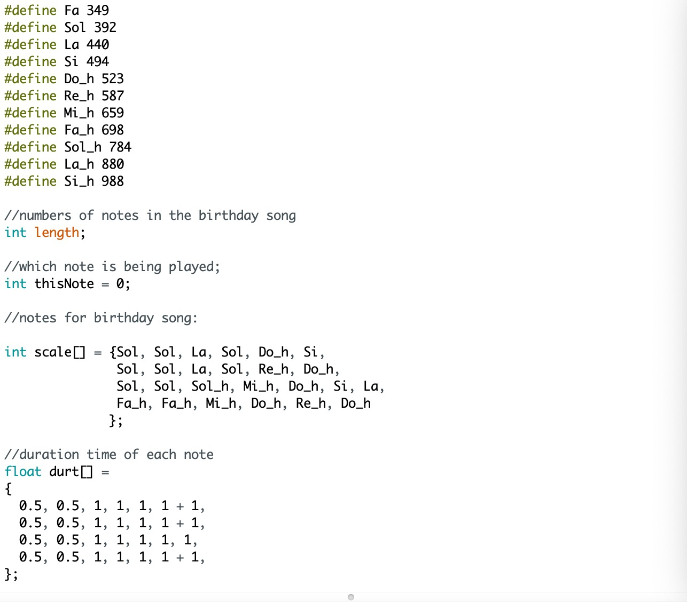
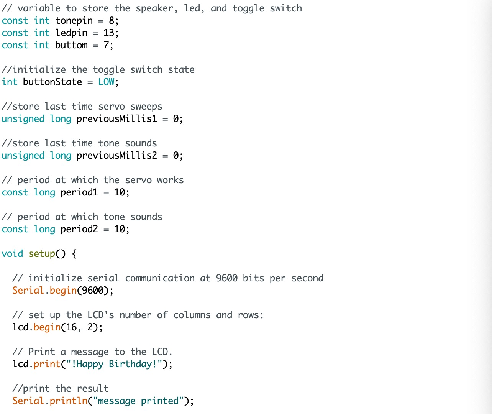
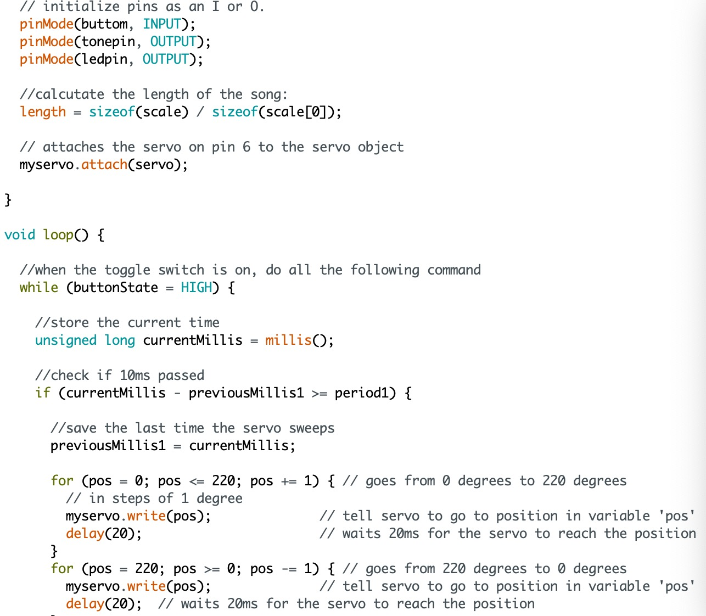
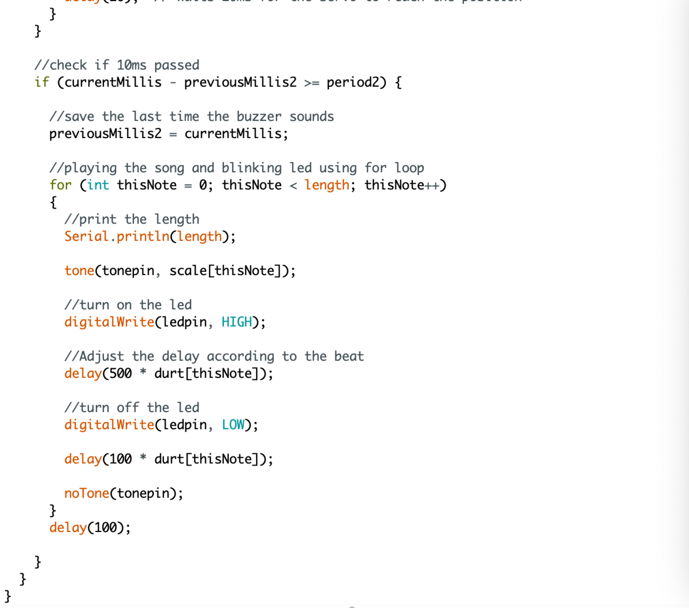

**Happy Birthday!!**
===================

Concept
-----------

My project is not only an assignment but also a birthday gift. The concept was to make a wooden birthday song box with multiple inputs and outputs. I started off with the idea of there being a toggle switch, potentiometer, LCD, servo motor, led, and speaker. The toggle switch works like a power switch that controls all the electronic components. Once the switch is turned on, the screen would print "Happy Birthday", and the servo would start sweep, and the speaker would play the birthday song, and the led would blink in harmony with the rhythm.

With that in mind, I first made a **schematic** of the whole thing:

Then I wired everything up:

Soldering
-----------

The soldering wasted me a lot of time, because often I did not find the wires too short until I had finished soldering a component and used it, and I needed to start all over again. I learned that when I came to solder later, I’d better take a longer wire than that I expected it to be because I could not predict what would change in the project later.

Coding
--------

I didn't think the code for this project was too uncomplicated because we had learned most of it, but when I actually started writing the program, I still encountered a couple of problems. For example, multitasking: how to make buzzer and servo work without delay. Although the professor mentioned the millis( ) in class, I still couldn't really practice it, so I asked the professor and found some online tutorials, and finally, the two functions can happen without any delay.

This is my code:

Lessons Learned
-------------

One major lesson that I learned through this project was that the physical device could be the most time-consuming part, especially if I want to make it look aesthetically pleasing. For this project, I spent more than five hours every day for three days but even that was not enough. At every step of making it, I faced some unexpected problems and it would take a lot of time to fix them. Also, To keep each component stable at where it should be, I used several small tools inside the box, such as wooden sticks and staples as shown in the image below, which also took me a lot of time.

Video
----------
[Here](https://youtu.be/hPjaMqnN2Wc) is the video of the whole project : )
